# Health Action Squad

> **Kaggle Agents Intensive Capstone Project (Concierge Agents Track)**
> *Your Personal Health Concierge: Turning Medical Anxiety into Actionable Clarity.*

<p align="center">
  
</p>


[](https://www.python.org/downloads/)
[](https://google.github.io/adk-docs/)
[](https://github.com/psf/black)
[](https://opensource.org/licenses/MIT)

---

## 💡 The Problem: "The Red Number Anxiety"

We've all been there. You get your annual health check report. It's full of numbers. Some are red.

> *"LDL 160 mg/dL... is that an emergency?"*
> *"My doctor's appointment is 2 weeks away... what do I do until then?"*

**The Gap**: Between receiving a report and seeing a doctor, there is a void filled with **anxiety, confusion, and inaction**.
**The Cost**: Trying to decipher medical jargon alone is stressful. Booking an immediate consultation just to ask "is this bad?" is expensive and time-consuming.

## 🎯 Our Solution: Your Pre-Doctor Consultant

**Health Action Squad** is NOT a replacement for your doctor. It is your **intelligent concierge** that bridges the gap.

It acts as a "pre-deployment" team that:
1.  **Translates** confusing data into plain English.
2.  **Calms** anxiety by contextualizing risks (e.g., "This is high, but here are immediate lifestyle steps").
3.  **Prepares** you for your doctor's visit with a structured summary and questions.

**Goal**: To remove the fear of the unknown and empower you to take *safe, immediate action* while waiting for professional care.

```mermaid
graph TD
    User[User Health Report] --> Analyst[🕵️ Analyst Agent]
    Analyst -->|Risk Tags & Analysis| Planner[📋 Planner Agent]
    
    subgraph "Planning Loop(Max 3 Iterations)"
        Planner -->|Draft Plan| Guard[🛡️ Guard Agent]
        Guard -->|Review against Safety Rules| Decision{Approved?}
        Decision -- No (Feedback) --> Planner
        Decision -- Yes --> Final[✅ Final Action Plan]
    end
```



### 🧠 Core Agent Concepts Applied

We demonstrate mastery of **6+ key agentic concepts**:

1.  **Sequential Orchestration**:
    *   **Concept**: Chaining agents where the output of one becomes the input of the next.
    *   **Implementation**: `Analyst` parses data -> `Planner` creates strategy -> `Guard` validates safety.

2.  **Looping & Self-Correction**:
    *   **Concept**: Agents that can "think again" based on feedback.
    *   **Implementation**: The `Planner` refines its plan up to 3 times if the `Guard` rejects it.

3.  **Tool Use**:
    *   **Concept**: Agents using functions to control flow or access data.
    *   **Implementation**: The `Guard` uses the `exit_loop` tool to signal success and break the retry cycle.

4.  **Context & Memory**:
    *   **Concept**: Maintaining state across a multi-turn conversation.
    *   **Implementation**: The system preserves `health_analysis` and `validation_result` context across iterations so the Planner knows *why* it failed.

5.  **Structured Output**:
    *   **Concept**: Forcing agents to return machine-readable data (JSON) instead of free text.
    *   **Implementation**: The `Analyst` outputs strict JSON with `risk_tags` for deterministic downstream logic.

6.  **Prompt Engineering & Context Injection**:
    *   **Concept**: Dynamically inserting data into prompts at runtime.
    *   **Implementation**: We inject specific user profiles (e.g., "Age: 42, Location: Taiwan") into the Planner's system prompt to tailor advice.

---

## ✨ Key Features

### 1. 🌏 Regional Adaptability (Asian/Taiwan Context)
Health isn't one-size-fits-all. Our system is designed to respect regional nuances, particularly for **Asian populations**:
*   **BMI Sensitivity**: Recognizes that Asian populations have different BMI risk thresholds (e.g., BMI ≥ 23 is overweight in many Asian guidelines vs. 25 globally).
*   **Dietary Relevance**: Suggests culturally appropriate food swaps (e.g., brown rice/tofu instead of generic western recommendations) when the user profile indicates.
*   **Local Healthcare Context**: Prepares users for the specific "high-volume, short-consultation" environment common in Taiwan/Asia by prioritizing questions for the doctor.

### 2. 🛡️ Safety-First Design (The "Guard" Rail)
We know health is sensitive. Our **Guard Agent** strictly enforces:
*   **No Prescriptions**: We never suggest medication dosages.
*   **Mandatory Disclaimers**: Every plan includes a **prominent, non-negotiable medical disclaimer** with clear formatting.
*   **Source Citation**: All recommendations are backed by credible sources (AHA, CDC, WHO, NIH) formatted as **clickable Markdown links**.
*   **Automated Validation**: Plans are rejected if sources are missing or improperly formatted.

### 3. 🧘 Personalized Concierge
Unlike a generic "eat healthy" search result, we tailor advice to *your* numbers:
*   *High BP?* -> Focus on DASH diet and sodium reduction.
*   *High Glucose?* -> Focus on carb counting and post-meal walks.
*   *Sedentary?* -> Start with manageable 10-minute walks, not marathons.

### 4. ⚡ Real-Time Progress Streaming
We value transparency. Our system uses **Server-Sent Events (SSE)** to stream real-time progress updates:
*   **Live Feedback**: Watch as the system validates files, runs OCR, and coordinates agents.
*   **Step-by-Step Visibility**: See exactly which agent (Analyst, Planner, Guard) is working on your case.
*   **No More Guessing**: Replaces generic loading spinners with meaningful status updates.

---

## 🚀 Quick Start

### Prerequisites
*   Python 3.9+
*   Gemini API Key ([Get here](https://aistudio.google.com/app/apikey))

### Installation

```bash
# 1. Clone the repo
git clone https://github.com/KLTsai/health-action-squad.git
cd health-action-squad

# 2. Setup Virtual Environment
python -m venv venv
source venv/bin/activate  # Windows: venv\Scripts\activate

# 3. Install Dependencies
pip install -r requirements.txt

# 4. Configure Environment
cp .env.example .env
# Edit .env and add your GEMINI_API_KEY
```

### Usage

**Run the CLI Demo:**
```bash
python main.py --input resources/data/sample_health_report.json
```

**Start the API Server:**
```bash
uvicorn src.api.server:app --reload --port 8000
# Open http://localhost:8000/docs to test the API
# Streaming endpoints: /api/v1/generate_plan_stream, /api/v1/upload_report_stream
```

---

## 📹 Demo & Deployment
 
 > **[Watch the Demo Video (YouTube)](YOUR_YOUTUBE_LINK_HERE)**  
 > *See the Health Action Squad in action, turning a complex report into a simple plan.*
 
 ### 🖥️ Live UI (Streamlit)
 
 We provide a modern, user-friendly interface powered by **Streamlit**.
 
 **To run the UI locally:**
 
 1.  **Start the System** (Windows - Quickest):
     ```bash
     run_app.bat
     ```
     *This script runs both the API server and Streamlit UI in the same terminal window (no popup windows).*
 
 2.  **Manual Start** (Alternative):
     ```bash
     # Activate Virtual Environment first!
     # Windows: venv\Scripts\activate
     # Mac/Linux: source venv/bin/activate
 
     # Terminal 1: Start API
     uvicorn src.api.server:app --reload --port 8000
 
     # Terminal 2: Start UI
     streamlit run src/ui/app.py
     ```
     
     **Note**: To stop the application, press `Ctrl+C` in the terminal.
 
 3.  **Access**: Open [http://localhost:8501](http://localhost:8501) in your browser.
 
 ### ☁️ Cloud Deployment
 
 This project is ready for **Streamlit Cloud** or **HuggingFace Spaces**.
 1.  Fork this repo.
 2.  Connect to Streamlit Cloud.
 3.  Set `src/ui/app.py` as the entry point.
 4.  Add `GEMINI_API_KEY` to secrets.

---

## 📊 Quality & Testing

We take reliability seriously.

*   **Test Coverage**: 79% (Unit, Integration, Validation tests).
*   **Medical Integrity**: Automated tests ensure our guideline configurations (YAML) are never older than 90 days.
*   **Circuit Breaker**: The loop is hard-capped at 3 iterations to prevent infinite costs.

Run tests yourself:
```bash
pytest tests/
```

---

## 📁 Project Structure

```
health-action-squad/
├── src/
│   ├── agents/          # The Squad (Analyst, Planner, Guard)
│   ├── workflow/        # ADK Orchestration (Runner, Factory)
│   └── api/             # FastAPI Server
├── resources/
│   ├── policies/        # Safety Rules & Medical Guidelines (YAML)
│   └── data/            # Sample Health Reports
├── tests/               # Comprehensive Test Suite
└── docs/                # Images and Documentation
```

---

## 🤝 Contributing

We welcome contributions! Please see [CLAUDE.md](CLAUDE.md) for our coding standards.

## 👤 Author

**Kaggle Agents Intensive Capstone Project**
*Concierge Agents Track*

---
*Disclaimer: This tool is for informational purposes only and does not constitute medical advice. Always consult a professional healthcare provider.*
